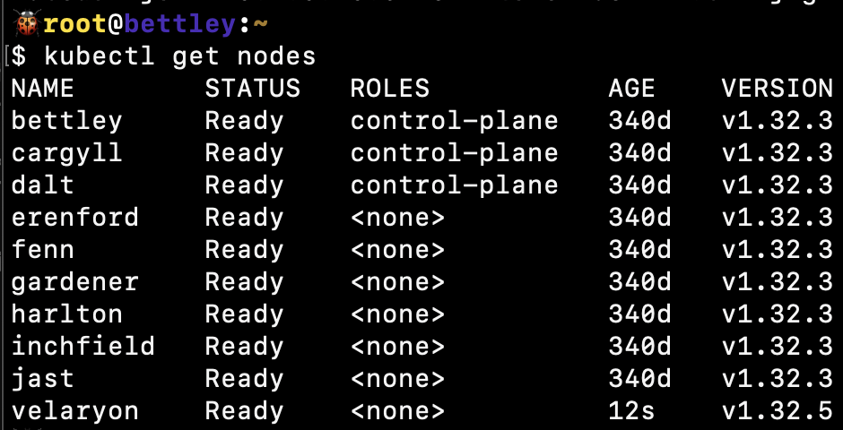

# New Server!

Today I saw [Beyond NanoGPT: Go From LLM Beginner to AI Researcher!](https://github.com/tanishqkumar/beyond-nanogpt) on HackerNews, and while I'm less interested than most in LLMs specifically, I'm still interested.

The notes included the following:

> The codebase will generally work with either a CPU or GPU, but most implementations basically require a GPU as they will be untenably slow otherwise. I recommend either a consumer laptop with GPU, paying for Colab/Runpod, or simply asking a compute provider or local university for a compute grant if those are out of budget (this works surprisingly well, people are very generous).

If this was expected to be slow on a standard CPU, it'd probably be unbearable (or not run at all) on a Pi, so this gave me pause 🤔

Fortunately, I had a solution. I have an extra PC that's a few years old but still relatively beefy (a Ryzen 9 3900X (12 cores) with 32GB RAM and an RTX 2070 Super). I built it as a VR PC and my kid and I haven't played VR in quite a while, so... it's just kinda sitting there. But it occurred to me that it was probably sufficiently powerful to run most of **Beyond NanoGPT**, and if it struggled with anything I might be able to upgrade to an RTX 4XXX or 5XXX.

Of course, this single machine by itself dominates the rest of Goldentooth, so I'll need to take some steps to minimize its usefulness.

## Setup

I installed Ubuntu 24.04, which I felt was probably a decent parity for the Raspberry Pi OS on Goldentooth. Perhaps I should've installed Ubuntu on the Pis as well, but hindsight is 20/20 and I don't have enough complaints about RPOS to switch now. At some point, SD cards are going to start dropping like flies and I'll probably make the switch at that time.

The installation itself was over in a flash, quickly enough that I thought something might've failed. Admittedly, it's been a while since I've installed Ubuntu Server Minimal on a modern-ish PC.

After that, I just needed to lug the damned thing down to the basement, wire it in, and start running Ansible playbooks on it to set it up. A few minutes later:


Hello, **Velaryon**!

Oh, and install Nvidia's kernel modules and other tools. None of that was particularly difficult, although it was a tad more irritating than it should've been.

Once I had the GPU showing up, and the relevant tools and libraries installed, I wanted to verify that I could actually run things on the GPU, so I checked out NVIDIA's [cuda-samples](https://github.com/NVIDIA/cuda-samples) and built 'em.

With that done:

```
🐠nathan@velaryon:~/cuda-samples/build/Samples/1_Utilities/deviceQueryDrv
$ ./deviceQueryDrv
./deviceQueryDrv Starting...

CUDA Device Query (Driver API) statically linked version
Detected 1 CUDA Capable device(s)

Device 0: "NVIDIA GeForce RTX 2070 SUPER"
  CUDA Driver Version:                           12.9
  CUDA Capability Major/Minor version number:    7.5
  Total amount of global memory:                 7786 MBytes (8164081664 bytes)
  (40) Multiprocessors, ( 64) CUDA Cores/MP:     2560 CUDA Cores
  GPU Max Clock rate:                            1770 MHz (1.77 GHz)
  Memory Clock rate:                             7001 Mhz
  Memory Bus Width:                              256-bit
  L2 Cache Size:                                 4194304 bytes
  Max Texture Dimension Sizes                    1D=(131072) 2D=(131072, 65536) 3D=(16384, 16384, 16384)
  Maximum Layered 1D Texture Size, (num) layers  1D=(32768), 2048 layers
  Maximum Layered 2D Texture Size, (num) layers  2D=(32768, 32768), 2048 layers
  Total amount of constant memory:               65536 bytes
  Total amount of shared memory per block:       49152 bytes
  Total number of registers available per block: 65536
  Warp size:                                     32
  Maximum number of threads per multiprocessor:  1024
  Maximum number of threads per block:           1024
  Max dimension size of a thread block (x,y,z): (1024, 1024, 64)
  Max dimension size of a grid size (x,y,z):    (2147483647, 65535, 65535)
  Texture alignment:                             512 bytes
  Maximum memory pitch:                          2147483647 bytes
  Concurrent copy and kernel execution:          Yes with 3 copy engine(s)
  Run time limit on kernels:                     No
  Integrated GPU sharing Host Memory:            No
  Support host page-locked memory mapping:       Yes
  Concurrent kernel execution:                   Yes
  Alignment requirement for Surfaces:            Yes
  Device has ECC support:                        Disabled
  Device supports Unified Addressing (UVA):      Yes
  Device supports Managed Memory:                Yes
  Device supports Compute Preemption:            Yes
  Supports Cooperative Kernel Launch:            Yes
  Supports MultiDevice Co-op Kernel Launch:      Yes
  Device PCI Domain ID / Bus ID / location ID:   0 / 45 / 0
  Compute Mode:
     < Default (multiple host threads can use ::cudaSetDevice() with device simultaneously) >
Result = PASS
```

Not the sexiest thing I've ever seen, but it's a step in the right direction.

## Kubernetes

Again, I only want this machine to run in very limited circumstances. I figure it'll make a nice box for cross-compiling, and for running GPU-heavy workloads when necessary, but otherwise I want it to stay in the background.

After I added it to the Kubernetes cluster:



I tainted it to prevent standard pods from being scheduled on it:

```bash
kubectl taint nodes velaryon gpu=true:NoSchedule
```

and labeled it so that pods requiring a GPU would be scheduled on it:

```bash
kubectl label nodes velaryon gpu=true arch=amd64
```

Now, any pod I wish to run on this node should have the following:

```yaml
tolerations:
  - key: "gpu"
    operator: "Equal"
    value: "true"
    effect: "NoSchedule"
nodeSelector:
  gpu: "true"
```

## Nomad

A similar tweak was needed for the `nomad.hcl` config:

```hcl

client {
  enabled     = true
  node_class  = "{{ nomad.client.node_class }}"
  meta {
    arch  = "{{ ansible_architecture }}"
    gpu   = "{{ 'true' if 'gpu' == nomad.client.node_class else 'false' }}"
  }
}

```

I think this will work for a constraint:

```hcl
constraint {
  attribute = "${node.class}"
  operator  = "="
  value     = "gpu"
}
```

But I haven't tried it yet.

After applying, we see the class show up:

```bash
🐠root@velaryon:~
$ nomad node status
ID        Node Pool  DC   Name       Class    Drain  Eligibility  Status
76ff3ff3  default    dc1  velaryon   gpu      false  eligible     ready
30ffab50  default    dc1  inchfield  default  false  eligible     ready
db6ae26b  default    dc1  gardener   default  false  eligible     ready
02174920  default    dc1  jast       default  false  eligible     ready
9ffa31f3  default    dc1  fenn       default  false  eligible     ready
01f0cd94  default    dc1  harlton    default  false  eligible     ready
793b9a5a  default    dc1  erenford   default  false  eligible     ready
```

Other than that, it should get the standard complement of features - Vector, Consul, etc. I initially set up Slurm, then undid it; I felt it would just complicate matters.
