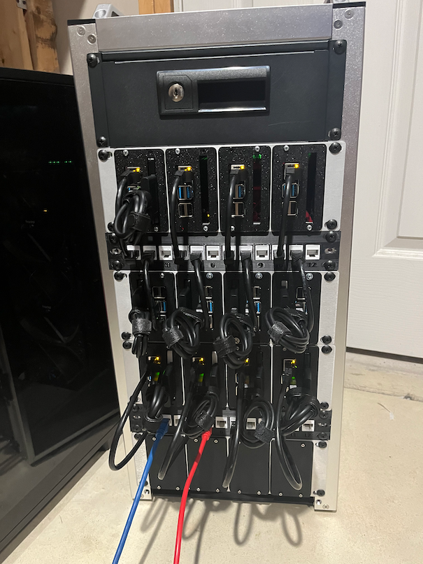

# New Rack!

I poked around a bit and realized that I had two extra Raspberry Pi 4B+'s, so I ended up spending an absolutely absurd amount of money to build a 10" rack and get all of the existing and new Pis into it, along with some fans, 5V and 12V power supplies, a 16-port switch, etc. It was absolutely ridiculous and I would not recommend this course of action to anyone, and I'll never financially recover from this.

The main goal of this was to take my existing Picocluster (which was screwed together and looked nice and... well, was already paid for) and have something where I could pull out an individual Pi and replace or repair it if I needed. Another issue was that I didn't really have any substantial external storage, e.g. SSDs.

I've been playing with some other things recently, and have delayed updating this too much. I was intending my current focus to be the next article in this clog, but I think it's going to take quite a lot longer (and will likely be the subject of a great many articles), so I think in the meantime I need to return to the subject of the actual cluster and progress it along.
